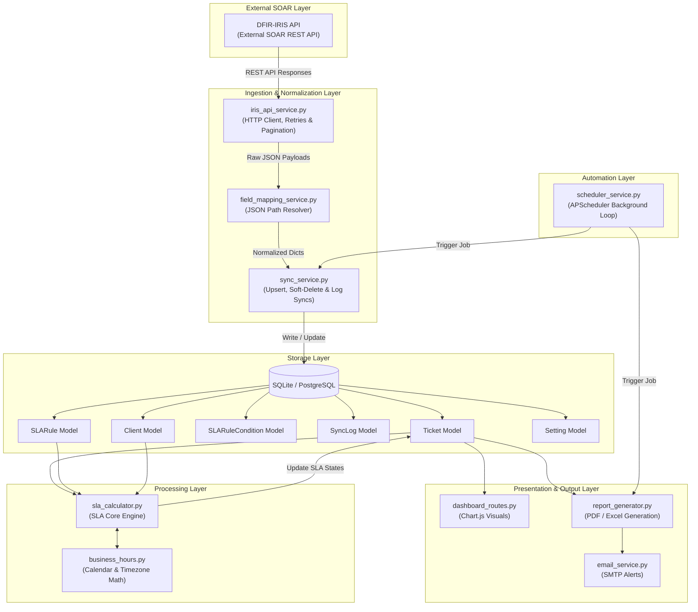
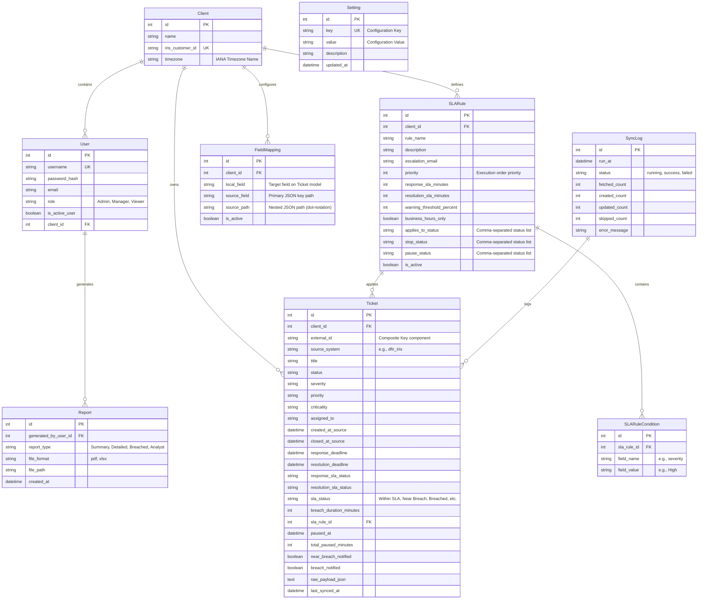

# Software Design Document: Automated SLA Tracking & Report Generation System

## 1. Executive Summary
The **Automated SLA Tracking & Report Generation System** is a multi-tenant middleware designed to integrate with the **DFIR-IRIS** Incident Response Platform (SOAR). It automates the extraction, normalization, and tracking of incident response and resolution SLAs (Service Level Agreements) across multiple client environments. The system dynamically computes SLA deadlines based on custom client business hours, manages incident pause/resume cycles, generates comprehensive PDF and Excel performance reports, and sends consolidated breach alerts to security managers.

---

## 2. System Architecture

The application is built on a modular, service-oriented architecture using the Flask **Application Factory Pattern** with Blueprints to separate routes by functional areas.

### 2.1 Architectural Flow Diagram
The data pipeline flows downward from the external SOAR platform to database ingestion, SLA evaluation, and output generation.



---

## 3. Data Models & Schema Design

The system implements 9 core models utilizing SQLAlchemy ORM. Multi-tenancy is enforced at the database layer via client scoping on core resources.



---

## 4. Service Components

### 4.1 Ingestion Wrapper (`services/iris_api_service.py`)
Fetches incident and alert data from DFIR-IRIS.
*   **Pagination (Gap #6):** Implements an envelope-aware loop that extracts parameters (`total`, `last_page`, `current_page`) from IRIS response metrics to fetch all available records.
*   **Robust Network Client (Gap #7):** Incorporates connection timeouts and transient error retries (status codes `429`, `500`, `502`, `503`, `504`) using exponential backoff:
    $$\text{Delay} = \text{backoff\_factor} \times (\text{backoff\_multiplier})^{\text{attempt}}$$

### 4.2 Translation Engine (`services/field_mapping_service.py`)
Decouples the system from DFIR-IRIS schemas, translating raw input into generic tickets.
*   **JSON Resolution:** Extends support for dot-notation paths (e.g., `owner.username` or `case_attributes.severity`) using a recursive `_get_nested()` helper.
*   **Datetime Standardization (Gap #5):** Standardizes mixed input datetimes, parses timezone offsets, and projects all timestamps onto the UTC timezone before persisting them. Naive datetimes are assumed to be in UTC.

### 4.3 SLA Rule Engine (`services/sla_calculator.py`)
Computes SLA metrics dynamically for every processed ticket.
*   **Evaluation Precedence (Gap #2):** Rules are matched inside `find_matching_sla_rule()` by evaluating rule conditions:
    $$\text{getattr(ticket, condition.field\_name)} \xrightarrow{\text{case-insensitive}} \text{condition.field\_value}$$
    Evaluations are sorted strictly by `priority ASC, id ASC` where the first matched rule is applied.
*   **Pause/Resume Accumulator (Gap #4):** Tracks ticket pause duration via a state change detector:
    1. If a ticket's status enters a configured `pause_status` list and `paused_at` is empty, record `paused_at = now()`.
    2. When the status changes to a non-paused status, compute the elapsed duration:
       $$\text{elapsed} = \text{now()} - \text{paused\_at}$$
       Add `elapsed` in minutes to `total_paused_minutes`, shift deadlines forward by `elapsed`, and clear `paused_at`.
*   **Business Hours Calendar Math (Gap #3 / `services/business_hours.py`):**
    Allows mapping SLAs strictly to operational windows (default: Monday to Friday, 09:00 - 17:00).
    *   Deadlines are computed locally relative to the target `Client.timezone` to prevent UTC offset variations from impacting business day calculations, then converted back to UTC.

```
Start (UTC) ──> Convert to Local TZ ──> Add SLA Minutes (Skip Weekends & Non-Work Hours) ──> Convert back to UTC ──> Persist
```

### 4.4 Ingestion Pipeline (`services/sync_service.py`)
Coordinates updates, inserts, deletions, and recalculations:
*   **Idempotency & Upsert (Gap #8):** Utilizes composite database index matching `(client_id, source_system, external_id)` to update matching tickets or create new records.
*   **Soft Deletion (Gap #8):** Identifies records that were removed from the external source and updates their local status to `deleted_in_source`, keeping SLA metrics historical records intact.
*   **Reopen Detection (Gap #10):** If an incident previously marked as resolved is synchronized with an open status (i.e. `closed_at_source` is cleared), the SLA status is cleared, forcing re-evaluation of the SLA engine.

---

## 5. Security & Multi-Tenancy

### 5.1 Multi-Tenancy Isolation (Gap #1)
Every data structure is logically isolated. Database interactions filter records against the user's assigned `client_id`. Shared administration functions are locked down, preventing data visibility across distinct tenant clients.

### 5.2 RBAC Matrix
The system enforces Role-Based Access Control (RBAC) across three distinct roles:

| Feature / Resource | Viewer | Manager | Admin |
|:---|:---:|:---:|:---:|
| View Dashboard & Charts | Read-only | Read-only | Read-only |
| View & Search Tickets | Read-only | Read-only | Read-only |
| Trigger Manual API Sync | ❌ | ✅ | ✅ |
| Generate & Download Reports | ❌ | ✅ | ✅ |
| Configure Settings & Field Mappings | ❌ | ❌ | ✅ |
| CRUD SLA Rules | ❌ | ❌ | ✅ |

### 5.3 Security Hardening Specifications (Gap #9)
*   **CSRF Protection:** Flask-WTF integration enforces validation tokens for all state-changing endpoints (POST/PUT/DELETE).
*   **Session Hardening:** Configured with secure session cookie headers:
    *   `SESSION_COOKIE_HTTPONLY = True` (mitigates XSS cookie theft)
    *   `SESSION_COOKIE_SAMESITE = 'Lax'` (mitigates CSRF exploits)
    *   `PERMANENT_SESSION_LIFETIME = 8 Hours` (mitigates idle session persistence)
*   **Login Lockouts:** Implements rate-limiting on authentication pathways. Five unsuccessful logins within a rolling 15-minute window trigger a temporary username lock. Lockouts are logged under warning levels.

---

## 6. Report Generation & Storage Lifecycle

The reporting layer generates high-fidelity documents on demand or via scheduler automation.

### 6.1 Report Profiles
1.  **SLA Summary Report:** Compliance ratios, total breaches, warning distributions.
2.  **Detailed Ticket SLA Report:** Detailed incident listing with response and resolution compliance details.
3.  **Breached Tickets Report:** Target analysis focusing exclusively on incidents exceeding SLA parameters.
4.  **Analyst Performance Report:** Compliance metrics segmented by individual assignees.

### 6.2 Exporters
*   **PDF Exporter (ReportLab):** Generates landscape-oriented documents utilizing structured tabular layouts, alternating row colors for readability, and consistent typographic hierarchies. Capped at 500 rows for size constraints.
*   **Excel Exporter (Pandas + OpenPyXL):** Exports multi-sheet workbooks dividing high-level metrics (Summary sheet) from raw records (Details sheet).

### 6.3 Cleanup & Retention Policies (Gap #11)
To optimize storage, a background service (`services/cleanup_service.py`) runs every Sunday at 03:00 to purge generated files and database records exceeding the **90-day retention threshold**.

---

## 7. Design Gaps Resolved

The implementation addresses 11 critical design gaps discovered during system analysis:

| Gap # | Description | Architectural Solution |
|-------|-------------|-----------------------|
| **Gap #1** | Multi-Tenancy Isolation | Added `client_id` scoping to Tickets, SLA Rules, and Field Mappings. All DB queries are filtered on client IDs. |
| **Gap #2** | Rule Evaluation Precedence | Introduced `priority` ordering to rules (lower number wins). System evaluates conditions in strict priority order. |
| **Gap #3** | Business Hours Calculations | Developed timezone-aware calendar shifting to skip weekends and non-business hours (Mon-Fri 09:00 - 17:00). |
| **Gap #4** | Clock Pause/Resume Semantics | Added `paused_at` and `total_paused_minutes` trackers. Automatically shifts response/resolution deadlines forward. |
| **Gap #5** | Timezone Uniformity | Implemented UTC storage standard. `_as_aware()` forces naive timestamps to UTC; client timezone is used only for calendar math. |
| **Gap #6** | REST API Pagination | Built envelope-aware pagination loops analyzing total, page, and current indexes from IRIS JSON responses. |
| **Gap #7** | API Request Resilience | Added transient fault retries (status 429/5xx) with exponential backoff and request timeouts. |
| **Gap #8** | Sync Idempotency & Deletion | Implemented composite key upsert check and soft-deletes (`status='deleted_in_source'`) to preserve historical metrics. |
| **Gap #9** | Security Hardening | Integrated CSRF protection, secure cookie settings, Werkzeug password hashing, and login lockouts (5 failed attempts). |
| **Gap #10** | Sync Reopen Detection | Detects tickets reopened in source (clearing closed timestamps) and resets SLA status for re-evaluation. |
| **Gap #11** | Storage Retention Policies | Implemented a weekly scheduled service to prune generated files and database records older than 90 days. |

---

## 8. Testing Strategy

The test suite runs inside a mock environment using `pytest` to guarantee component reliability:

```
tests/
 ├── conftest.py                # Database fixture hooks & mocked API dependencies
 ├── test_sla_calculator.py     # SLA Engine, timezone shifts, and pause calculations
 └── test_sync_service.py       # Upsert logic, soft-deletion, and client resolution
```

*   **Mocking:** Network operations to the DFIR-IRIS API are mocked via `unittest.mock.patch` to verify correct parser outputs without external connectivity.
*   **Test DB Isolation:** Tests run against in-memory SQLite instances (`sqlite:///:memory:`) instantiated and torn down for each test run.
*   **Coverage Targets:** Covers SLA rule matching, precedence logic, timezone-aware calendar shifts, pause/resume accumulation, upserts, soft-deletes, and reopened cases.

