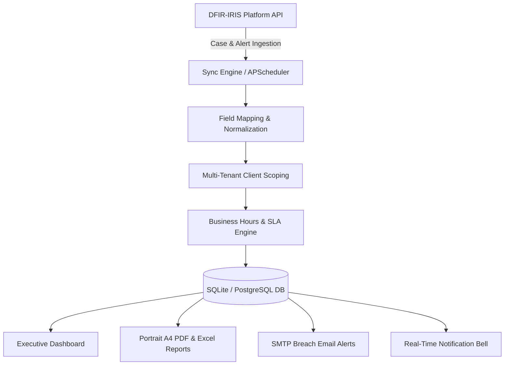

# Enterprise Automated SLA Tracking & Executive Reporting System

[](https://www.python.org/)
[](https://flask.palletsprojects.com/)
[]()
[]()
[]()

A production-ready, multi-tenant SLA Tracking & Executive Shift Handover Reporting Middleware built for Managed Security Service Providers (MSSPs) and Incident Response teams integrating with DFIR-IRIS.

---

## Key Features

### Real-Time SLA Alerting & Notification Bell
- **Navbar Bell Dropdown**: Live unread badge count surfacing critical SLA alerts across all pages.
- **Urgency Categorization**:
  - **Near Breach (Amber)**: Live minute-by-minute countdown warnings for tickets nearing resolution deadlines.
  - **Breached SLA (Red)**: Immediate notification for breached cases showing exact breach duration.
- **Direct Triage**: One-click navigation to ticket details for immediate investigation.

### Executive Reporting Engine (Portrait A4 PDF & Excel)
- **Portrait A4 PDF Standard**: Engineered with ReportLab `NumberedCanvas` for clean `Page X of Y` rendering.
- **Corporate Branding**: Headers & footers feature company logo branding (`static/images/image.png`).
- **Target Client Metadata**: Displays specific client scoping or all-client aggregates.
- **KPI Summary Cards**: Total Incidents, SLA Compliance Rate, Breached Count, and Mean Time to Resolution (MTTR).

### SLA Breach Root Cause Tagging & Analytics
- **Root Cause Classification**: Tag breached cases with categories (*Vendor Delay*, *Customer Unresponsive*, *Third-Party Outage*, *Staff Shortage*, *Technical Complexity*, or *Custom*).
- **Interactive Doughnut Chart**: Live visual breakdown on the executive dashboard to identify operational bottlenecks.
- **Audit Notes**: Field for recording investigation details for client shift handovers.

### Business Hours & Pause/Resume SLA Engine
- **Custom Business Calendars**: Computes SLA deadlines strictly within working hours (e.g., Mon–Fri 09:00–18:00 PKT), skipping nights, weekends, and holidays.
- **Clock Shifting on Pause**: When tickets enter pending/paused states (*Awaiting Customer*, *Vendor Hold*), deadlines shift forward dynamically to protect SLA integrity.

### Enterprise Security & RBAC Isolation
- **Role-Based Access Control**:
  - **Admin**: Full system access (settings, field mappings, SLA rules, client CRUD, audit logs).
  - **Manager**: Operations management (ticket view, SLA recalculations, root cause tagging, report generation).
  - **Viewer**: Read-only stakeholder monitoring.
- **OWASP Top 10 Hardened**: Includes brute-force login lockout, CSRF protection, security headers (`X-Frame-Options`, `CSP`), and restricted raw payload debugging.

---

## System Architecture



---

## Role Permission Matrix

| Feature / Action | Admin | Manager | Viewer |
| :--- | :---: | :---: | :---: |
| **View Dashboard & SLA Metrics** | Yes | Yes | Yes |
| **View Tickets & SLA Timelines** | Yes | Yes | Yes |
| **View Generated Reports & Download** | Yes | Yes | Yes |
| **Update SLA Breach Root Cause** | Yes | Yes | Read-Only |
| **Generate New PDF & Excel Reports** | Yes | Yes | Restricted |
| **Manage SLA Rules & Conditions** | Yes | Restricted | Restricted |
| **Manage Clients (Create, Edit, Delete, Toggle)** | Yes | Restricted | Restricted |
| **Manage System Settings & IRIS Integration** | Yes | Restricted | Restricted |
| **Manage Holiday Calendar & View Audit Logs** | Yes | Restricted | Restricted |

---

## Project Directory Structure

```text
automated-sla-tracker/
├── app.py                          # Flask application factory & context processors
├── config.py                       # Application configuration from .env
├── extensions.py                   # Shared Flask extensions (SQLAlchemy, Login, CSRF)
├── cli.py                          # Custom Flask CLI management commands
├── models/                         # Database ORM Schemas
│   ├── client.py                   # Multi-tenancy anchor, timezone & business hours
│   ├── user.py                     # RBAC users & permission matrix
│   ├── ticket.py                   # Local normalized tickets & SLA thresholds
│   ├── sla_rule.py                 # Dynamic SLA rules & conditions
│   ├── field_mapping.py            # Local-to-IRIS field translation map
│   ├── report.py                   # Generated report audit history
│   └── setting.py                  # Runtime configuration settings
├── services/                       # Core Business Logic & Engines
│   ├── iris_api_service.py         # DFIR-IRIS REST API integration client
│   ├── sla_calculator.py           # Business hours deadline & pause math engine
│   ├── report_generator.py         # ReportLab Portrait A4 PDF & Excel generator
│   ├── sync_service.py             # Case ingestion & normalization pipeline
│   ├── email_service.py            # SMTP breach alert notifier
│   └── scheduler_service.py        # Background APScheduler service
├── routes/                         # Application Controllers (Blueprints)
│   ├── auth_routes.py              # Authentication & login rate limiter
│   ├── dashboard_routes.py         # Executive dashboard & metrics endpoints
│   ├── ticket_routes.py            # Ticket management & root cause tagging
│   ├── sla_rule_routes.py          # SLA rules CRUD management
│   ├── report_routes.py            # Report generation, download & deletion
│   └── settings_routes.py          # Settings, Client CRUD & Holiday Calendar
├── templates/                      # Jinja2 HTML5 Responsive Templates
└── tests/                          # Comprehensive Pytest Suite (95 Unit Tests)
```

---

## Environment Configuration (`.env`)

Copy `.env.example` to `.env` and configure key variables:

```env
# Flask App Settings
SECRET_KEY=your-secure-random-secret-key
FLASK_ENV=development
DATABASE_URL=sqlite:///instance/sla_tracker.db

# DFIR-IRIS Integration
IRIS_BASE_URL=https://iris.example.com
IRIS_API_KEY=your_secured_api_key_here
IRIS_VERIFY_SSL=True
SYNC_INTERVAL_MINUTES=15

# SMTP Email Alerting
EMAIL_NOTIFICATIONS_ENABLED=True
SMTP_HOST=smtp.example.com
SMTP_PORT=587
SMTP_USER=alerts@example.com
SMTP_PASSWORD=your_smtp_password
SMTP_FROM_EMAIL=alerts@example.com
```

---

## Quick Start Guide

### 1. Clone & Environment Setup
```bash
# Clone the repository
git clone https://github.com/abdullaW17/SLA-Tracking-with-Shift-Handover-Report.git
cd SLA-Tracking-with-Shift-Handover-Report

# Create virtual environment
python -m venv venv
source venv/bin/activate  # Windows: venv\Scripts\activate

# Install dependencies
pip install -r requirements.txt
```

### 2. Database Initialization & Seeding
```bash
# Seed initial database schemas, roles, and demo users
flask seed
```

#### Demo User Accounts:
| Role | Username | Password | Access Level |
| :--- | :--- | :--- | :--- |
| **Administrator** | `admin` | `Admin123!` | Full System Control |
| **Manager** | `manager` | `Manager123!` | Operations & Reporting |
| **Viewer** | `viewer` | `Viewer123!` | Read-Only Monitoring |

> [!CAUTION]
> Always change default passwords in production environments!

### 3. Running the Server
```bash
python app.py
```
Access the web dashboard at: `http://localhost:5000`

---

## Testing & Verification

Run the full automated test suite containing **95 verified unit & integration tests**:

```bash
pytest -v
```

---

## Production Deployment

### Vercel (Serverless Deployment)
This repository includes a production-ready `vercel.json`:
1. Connect your repository in the Vercel Dashboard.
2. Configure Environment Variables (`DATABASE_URL`, `SECRET_KEY`, `IRIS_BASE_URL`, `IRIS_API_KEY`).
3. Deploy!

### Render (Containerized Web Service)
This repository includes a `render.yaml` Blueprint specification:
1. Create a new Blueprint on Render.
2. Connect your GitHub repository.
3. Render automatically provisions a Python Web Service running `gunicorn app:app`.

---

## Security Reporting
For security concerns or vulnerability disclosures, please refer to [SECURITY.md](SECURITY.md) or contact **ma4200417@gmail.com**.

---

## License
This project is licensed under the MIT License - see [LICENSE](LICENSE) for details.
